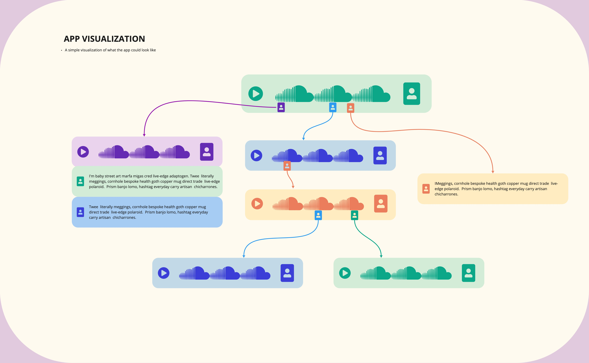
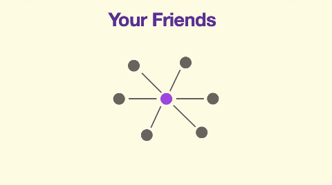
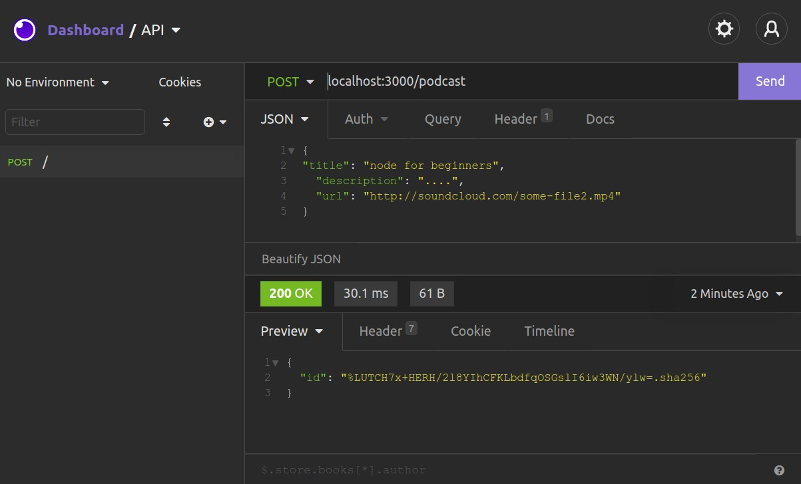
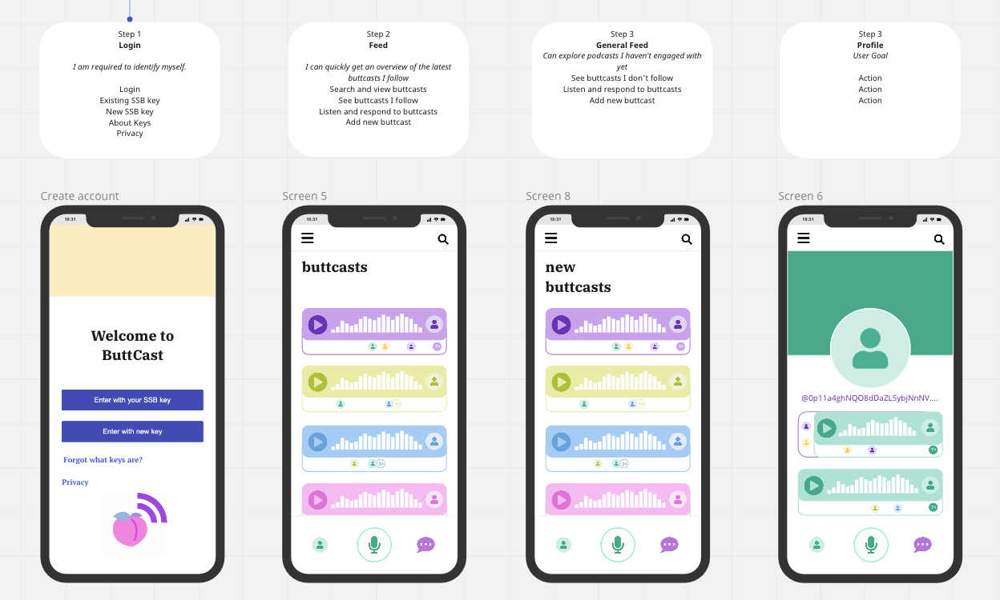

# Butt Cast

Welcome!

This page will be updated as the project goes along ~

The etymology of the name BUTTCAST [ /bʌt/kæst/ ] stems from the protocol on which ButtCast runs, the gossiping protocol of [Scuttlebutt](https://scuttlebutt.nz/) (SSB). The origin of the gaudy nature of the name also has it's roots in the culture of the Scuttlebutt community, where it (by some) is deemed desirable to have as non-commercial of an imagery in order to communicate values of post-capitalist nature.   


*(image courtesy of [@mix](https://github.com/mixmix))*


## Purpose

This project has three main purposes: 

1. Make a cool app which enables people to async communicate with each other using audio clips, building on the distributed communication protocol SSB

2. Serve as a way for me to learn how to code and build SSB apps

3. Help others with learning how to build apps by making a guide that even a beginner (such as myself) can follow based on the latest (09.02.22) tech in the SSB ecosystem utilizing [Metafeeds](https://soapdog.github.io/scuttlebutt-protocol-guide/#metafeeds) and [Crut](https://gitlab.com/ahau/lib/ssb-crut) . 

This project would not have been possible if not for the support of [@arj](https://github.com/arj03) and [@mix](https://github.com/mixmix) who are guiding me. Many thanks 🙏🌸

## The App 

The idea of the app is an asynchronous conversation app. The general design is in process so here is a visualization in the meantime:



---

## Development Setup

Clone down this repo, then install the modules:
```bash
npm install
```

Start the API in dev-mode:
```bash
npm run dev
```

For testing:
```bash
npm test
```

## API

  | ROUTE                  | HTTP METHOD | PURPOSE
--|------------------------|-------------|---------------------------
✓ | /podcast               | GET         | Get all podcasts
✓ | /podcast               | POST        | Create a new podcast
  | /podcast/:id           | GET         | Get a particular podcast
✓ | /podcast/:id           | PUT         | Update a particular podcast
✓ | /podcast/:id           | DELETE      | Tombstone a particular podcast
  |                        |             |
  | /podcast/:id/comment   | GET         | Get all comment associated with a particular podcast
✓ | /podcast/:id/comment   | POST        | Create a comment associated with a particular podcast
  |                        |             |
✓ | /comment               | GET         | Get all podcasts
✓ | /comment/:id           | GET         | Get a particular comment
✓ | /comment/:id           | PUT         | Update a particular comment
✓ | /comment/:id           | DELETE      | Tombstone a particular comment

If you want to get the ten latest comments you can use queries e.g.  `GET` to `/comment?limit=10`

---

## The Guide (Roadmap)

### Intro to SSB
Secure Scuttlebutt (SSB) is an offline-first communications protocol, also known as "The gossiping protocol". SSB works in a similar way to how people share data among each other, if your friend tells you something, you now have that information, and can tell it forwards to other friends, unless it was said in private of course! 



The data you get from your friends is stored in "logs", you hold copies of all your friends, and their friends "logs" locally on your computer. Having local copies enables the data to be shared in many different ways, from radio, to bluetooth, over meshnet works and more ~

For a detailed overview of how Scuttlebutt works, see the [this documentation](https://soapdog.github.io/scuttlebutt-protocol-guide/) explaining the core functionality of Scuttlebutt. For more technical info in general, see the [Treasure Map](https://dev.scuttlebutt.nz/#/)! ✨

In this guide we will using a case example of a podcast app (the Buttcast) for going through the tutorial.

Now - let's dive into how to build an app! 

### Step 0 - Setting up the base

#### Installing stuff
Here we will present some of the building blocks needed to build an SSB app:

##### Install Electron
- Install [electron](https://www.electronjs.org/) 
- Electron enables us to package the application

##### Install Insomia 
- Insomnia enables us to easily work with the backend through simulating a front end with APIs
- Install [insomnia](https://insomnia.rest/download)

Check Insomnia_scripts.json for examples



It is also possible to build directly in the browser yet that will not be a part of this guide.

#### Best practices
- Have commit history 
- Commit tidy bundles

### Step 1 - Building the app backend (optional order) (Anders, showing how it can be used in front-end)

- Make test with back-end and front end

- Using metafeeds (one ID but multiple "Main Feeds")

#### Metafeeds

In this tutorial we will be using the newly developed feature of SSB called "Metafeeds". Metafeeds work by enabling multiple feeds for one ID, this means that an app can have a single feed and a different app another feed while both being connected to the same ID, for example. To get a more in-depth insight, see [here](https://soapdog.github.io/scuttlebutt-protocol-guide/#metafeeds).


#### Crut

Crut is a recent development in the Scuttle-verse (as some would call it) and enables "tombstoning" and updating posts, which previously wasn't possible due to the append-only logs. As based on the common acronym CRUD (Create, Read, Update, Delete) yet without "Delete", instead there's T for Tombstone CRUT! Read more about how [Crut](https://gitlab.com/ahau/lib/ssb-crut) works here.

#### Setting up the base for an SSB app

### 000 missing link to files for getting started!

The following is a base to set up for any kind of app you would like to build.

`const express = require('express')` // the way you include libraries, aka code other people made. Express is our webserver thingy.

`const CRUT = require('ssb-crut')` // loads module "crut" to make it easy to create and update posts (for native scuttlebutters a comparison would be gatherings in current SSB stack) compared to static messages

`const SSB = require('../ssb')` // ".." goes backwards to the ssb.js file that is in the main folder

`const podcastModel = require('./podcast-model')` // related to the crut framework, it tells the crut how it should be able to work with "podcast-models", these could also be "gatherings" or "posts", if you'd prefer that! It automatically knows that it's a .json so no need to write out.

`const commentModel = require('./commentModel')` // links to the dependancies for the object Comment (which is created later on) in this case "commentModel"
const { length } = require('ssb-db2')

All of the above is just setting up what we're using, the following is starting to use it

### Assign Names to Functions
The next step is to name the different functions we will be using in the app. In this example case we want podcasts with comments, yet these can be exchanged to serve whatever purpose you have foor your app! 

const app = express() // app is now assigned to express() as a funcion

app.use(express.json()) // express now understands .json

const ssb = SSB() // continues naming our functions
const podcast = new CRUT(ssb, podcastModel) // new calls upon crut to create a new thing, in this case an array in SSB called "podcastModel"
const commentCrut = new CRUT(ssb, commentModel) // new calls upon crut to create a new thing, in this case a an array in SSB called "commentModel"

Here we are creating the base for our local storage of Comments and Podcasts, this base will grow as the usage of the app grows. 

#### Fetching & Posting local data

Now let's build our first API! Here we fetch the ID we have from our local database:

`app.get('/whoami', (req, res) => {
  res.send({ data: ssb.id })
  })` // request and respond, shows what ID you have in ssb. In this case we use a test SSB ID. To learn more about how to interact, see [express.js](https://expressjs.com/en/starter/hello-world.html) 
  
There are many more API's you can build, one highlighted tip is to go through the crut documentation and see what quieries you want to use, an especially useful native CRUT one is `opts.sortBy` which will enable smooth sorting of the data, avoiding some tricky fixes you might otherwise encounter. 


#### Sharing of the Data (through rooms and pubs)

Missing (!)


### UI Design

#### UI Scetches
Start with some scetches of the functionality, there are many programs which enable this, such as [Figma](https://www.figma.com/) or [Miro](https://www.figma.com/), in the case below, Miro was used to make a scetch. Remember, don't over-design anything, finish it to 80% so that you have an overview of what kind of functionality will be needed, the rest will also fall into place as you continue building the back-end.




#### Building the UI
Now that we have a scetch, we need to start building the design. Many people enjoy working with React and this is what we recommend here as well. 


### Bundle in Electron
Time to bundle with Electron! 

### Make an installer and distributing app 
- Publish


______
The text on this page has been edited by [@zelf](https://github.com/ZELFs) so far ~


