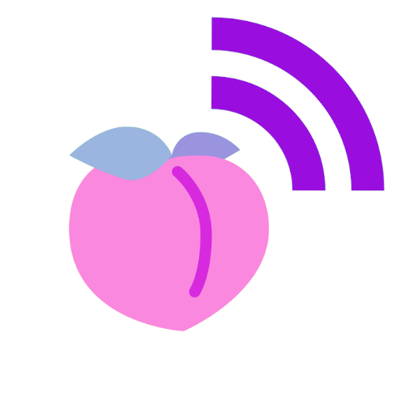

# Butt Cast

Welcome!

This page will be updated as the project goes along ~

The etymology of the name BUTTCAST [ /bʌt/kæst/ ] stems from the protocol on which ButtCast runs, the gossiping protocol of [Scuttlebutt](https://scuttlebutt.nz/) (SSB). The origin of the gaudy nature of the name also has it's roots in the culture of the Scuttlebutt community, where it (by some) is deemed desirable to have as non-commercial of an imagery in order to repel the creatures of the "crypto-bros".   



*(image courtesy of [@mix](https://github.com/mixmix))*


## Purpose

This project has three main purposes: 

1. Make a cool app which enables people to async communicate with each other using audio clips, building on the distributed communication protocol SSB

2. Serve as a way for me to learn how to code and build SSB apps

3. Help others with learning how to build apps by making a guide that even a beginner (such as myself) can follow based on the latest (09.02.22) tech in the SSB ecosystem utilizing metafeeds and room. 

This project would not have been possible if not for the support of [@arj](https://github.com/arj03) and [@mix](https://github.com/mixmix) who are guiding me. Many thanks 🙏🌸

## The App 

The idea of the app is an asynchronous conversation app. The general design is in process so here is a visualization in the meantime:


---

## Development Setup

Clone down this repo, then install the modules:
```bash
npm install
```

Start the API in dev-mode:
```bash
npm run dev
```

For testing:
```bash
npm test
```

## API

  | ROUTE                  | HTTP METHOD | PURPOSE
--|------------------------|-------------|---------------------------
✓ | /podcast               | GET         | Get all podcasts
✓ | /podcast               | POST        | Create a new podcast
  | /podcast/:id           | GET         | Get a particular podcast
✓ | /podcast/:id           | PUT         | Update a particular podcast
✓ | /podcast/:id           | DELETE      | Tombstone a particular podcast
  |                        |             |
  | /podcast/:id/comment   | GET         | Get all comment associated with a particular podcast
✓ | /podcast/:id/comment   | POST        | Create a comment associated with a particular podcast
  |                        |             |
✓ | /comment               | GET         | Get all podcasts
✓ | /comment/:id           | GET         | Get a particular comment
✓ | /comment/:id           | PUT         | Update a particular comment
✓ | /comment/:id           | DELETE      | Tombstone a particular comment

If you want to get the ten latest comments you can use queries e.g.  `GET` to `/comment?limit=10`

---

## The Guide (Roadmap)

### Step 0 - Setting up the base

#### Installing stuff
Here we will present some of the building blocks needed to build an SSB app:

##### Install Electron
- Install [electron](https://www.electronjs.org/) 
- Electron enables us to package the application

##### Install Insomia 
- Insomnia enables us to easily work with the backend through simulating a front end with APIs
- Install [insomnia](https://insomnia.rest/download)

Check Insomnia_scripts.json for examples


It is also possible to build directly in the browser yet that will not be a part of this guide.

#### Best practices
- Have commit history 
- Commit tidy bundles

### Step 1 - Building the app backend (optional order) (Anders, showing how it can be used in front-end)

- Make test with back-end and front end

- Using metafeeds (one ID but multiple "Main Feeds")

#### Storing data locally 
- Done, not documented

#### Fetching local data
- Done, not documented 

#### Sharing of the Data (through rooms and pubs)

### Step 2 (building the UX (Potentially Paul + Eileen?) )
- Build the UX

### Step 3 - Bundle in Electron (Mix is keen to support, potentially André for electron)
- Bundle in electron

### Step 4 - Make an installer and distributing app 
- Publish


______
The text on this page has been edited by [@zelf](https://github.com/ZELFs) so far ~


